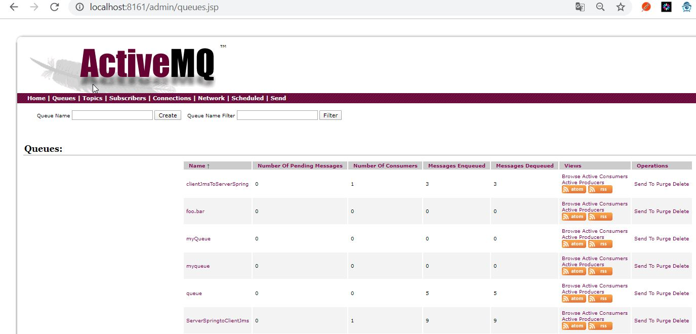

# JMS avec ActiveMQ


Telecharger activeMQ 5.15.12 et lancer activeMQ



[adminstration activeMQ](http://sleuthkit.org/autopsy/docs/user-docs/4.8.0/install_activemq.html)


https://examples.javacodegeeks.com/enterprise-java/jms/apache-activemq-failover-example/
https://examples.javacodegeeks.com/enterprise-java/jms/apache-activemq-load-balancing-example/


## demarrage de activeMQ
```bash
D:\activeMQ\apache-activemq-5.15.12-bin\apache-activemq-5.15.12\bin
λ activemq.bat start
Java Runtime: Oracle Corporation 1.8.0_162 C:\Program Files\Java\jdk1.8.0_162\jre
  Heap sizes: current=1005056k  free=989327k  max=1005056k
    JVM args: -Dcom.sun.management.jmxremote -Xms1G -Xmx1G -Djava.util.logging.config.file=logging.properties -Djava.security.auth.login.config=D:\activeMQ\apache-activemq-5.15.12-bin\apache-activemq-5.15.12\bin\..\conf\login.config -Dactivemq.classpath=D:\activeMQ\apache-activemq-5.15.12-bin\apache-activemq-5.15.12\bin\..\conf;D:\activeMQ\apache-activemq-5.15.12-bin\apache-activemq-5.15.12\bin\../conf;D:\activeMQ\apache-activemq-5.15.12-bin\apache-activemq-5.15.12\bin\../conf; -Dactivemq.home=D:\activeMQ\apache-activemq-5.15.12-bin\apache-activemq-5.15.12\bin\.. -Dactivemq.base=D:\activeMQ\apache-activemq-5.15.12-bin\apache-activemq-5.15.12\bin\.. -Dactivemq.conf=D:\activeMQ\apache-activemq-5.15.12-bin\apache-activemq-5.15.12\bin\..\conf -Dactivemq.data=D:\activeMQ\apache-activemq-5.15.12-bin\apache-activemq-5.15.12\bin\..\data -Djava.io.tmpdir=D:\activeMQ\apache-activemq-5.15.12-bin\apache-activemq-5.15.12\bin\..\data\tmp
Extensions classpath:
  [D:\activeMQ\apache-activemq-5.15.12-bin\apache-activemq-5.15.12\bin\..\lib,D:\activeMQ\apache-activemq-5.15.12-bin\apache-activemq-5.15.12\bin\..\lib\camel,D:\activeMQ\apache-activemq-5.15.12-bin\apache-activemq-5.15.12\bin\..\lib\optional,D:\activeMQ\apache-activemq-5.15.12-bin\apache-activemq-5.15.12\bin\..\lib\web,D:\activeMQ\apache-activemq-5.15.12-bin\apache-activemq-5.15.12\bin\..\lib\extra]
ACTIVEMQ_HOME: D:\activeMQ\apache-activemq-5.15.12-bin\apache-activemq-5.15.12\bin\..
ACTIVEMQ_BASE: D:\activeMQ\apache-activemq-5.15.12-bin\apache-activemq-5.15.12\bin\..
ACTIVEMQ_CONF: D:\activeMQ\apache-activemq-5.15.12-bin\apache-activemq-5.15.12\bin\..\conf
ACTIVEMQ_DATA: D:\activeMQ\apache-activemq-5.15.12-bin\apache-activemq-5.15.12\bin\..\data
Loading message broker from: xbean:activemq.xml
 INFO | Refreshing org.apache.activemq.xbean.XBeanBrokerFactory$1@eec5a4a: startup date [Sun Apr 12 14:50:20 CEST 2020]; root of context hierarchy
 INFO | Using Persistence Adapter: KahaDBPersistenceAdapter[D:\activeMQ\apache-activemq-5.15.12-bin\apache-activemq-5.15.12\bin\..\data\kahadb]
 INFO | PListStore:[D:\activeMQ\apache-activemq-5.15.12-bin\apache-activemq-5.15.12\bin\..\data\localhost\tmp_storage] started
 INFO | Apache ActiveMQ 5.15.12 (localhost, ID:DESKTOP-C5FOTFM-65436-1586695824694-0:1) is starting
 INFO | Listening for connections at: tcp://DESKTOP-C5FOTFM:61616?maximumConnections=1000&wireFormat.maxFrameSize=104857600
 INFO | Connector openwire started
 INFO | Listening for connections at: amqp://DESKTOP-C5FOTFM:5672?maximumConnections=1000&wireFormat.maxFrameSize=104857600
 INFO | Connector amqp started
 INFO | Listening for connections at: stomp://DESKTOP-C5FOTFM:61613?maximumConnections=1000&wireFormat.maxFrameSize=104857600
 INFO | Connector stomp started
 INFO | Listening for connections at: mqtt://DESKTOP-C5FOTFM:1883?maximumConnections=1000&wireFormat.maxFrameSize=104857600
 INFO | Connector mqtt started
 INFO | Starting Jetty server
 INFO | Creating Jetty connector
 WARN | ServletContext@o.e.j.s.ServletContextHandler@48e92c5c{/,null,STARTING} has uncovered http methods for path: /
 INFO | Listening for connections at ws://DESKTOP-C5FOTFM:61614?maximumConnections=1000&wireFormat.maxFrameSize=104857600
 INFO | Connector ws started
 INFO | Apache ActiveMQ 5.15.12 (localhost, ID:DESKTOP-C5FOTFM-65436-1586695824694-0:1) started
 INFO | For help or more information please see: http://activemq.apache.org
 INFO | ActiveMQ WebConsole available at http://0.0.0.0:8161/
 INFO | ActiveMQ Jolokia REST API available at http://0.0.0.0:8161/api/jolokia/
```  


## Les ports d'écoutes

 INFO | Listening for connections at: **tcp**://DESKTOP-C5FOTFM:**61616**?maximumConnections=1000&wireFormat.maxFrameSize=104857600                                                                                                                   
 INFO | Listening for connections at: **amqp**://DESKTOP-C5FOTFM:**5672**?maximumConnections=1000&wireFormat.maxFrameSize=104857600                                                                                                                   
 INFO | Listening for connections at: **stomp**://DESKTOP-C5FOTFM:**61613**?maximumConnections=1000&wireFormat.maxFrameSize=104857600                                                                                                                 
 INFO | Listening for connections at: **mqtt**://DESKTOP-C5FOTFM:**1883**?maximumConnections=1000&wireFormat.maxFrameSize=104857600                                                                                                                   
 INFO | Listening for connections at **ws**://DESKTOP-C5FOTFM:**61614**?maximumConnections=1000&wireFormat.maxFrameSize=104857600                                                                                                                     
 INFO | **ActiveMQ WebConsole** available at http://0.0.0.0:**8161**/                                                                                                                                                                                 
 INFO | ActiveMQ Jolokia **REST API** available at http://0.0.0.0:**8161**/api/jolokia/                                                                                                                                                               


**web console**  ( admin / admin)
http://localhost:8161/admin/queueGraph.jsp
