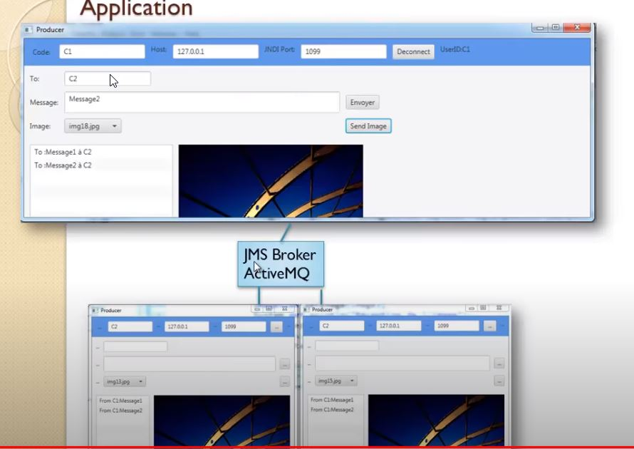
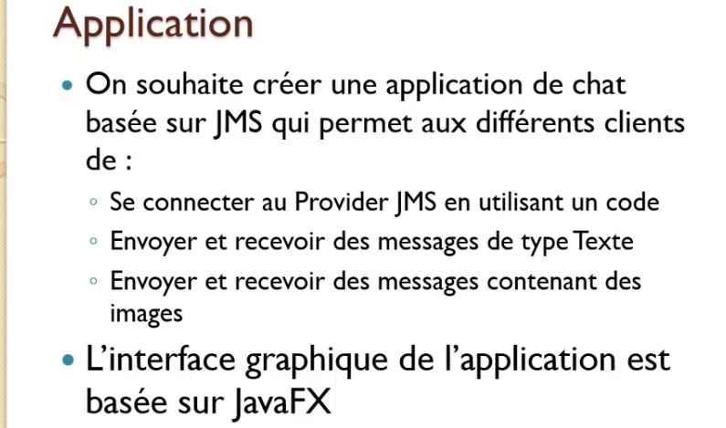
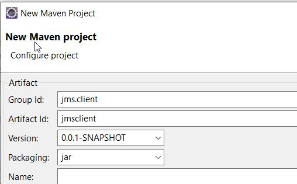
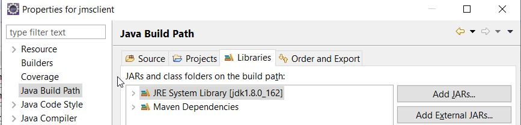

# Mise en Oeuvre Client JMS






##  Creation d'un projet maven pour le consumer et le producer



configurer le fichier pom.xml .

La version client doit etre la meme que celle du server ActiveMQ telechargé.

```xml
<!-- https://mvnrepository.com/artifact/org.apache.activemq/activemq-client -->
<dependency>
    <groupId>org.apache.activemq</groupId>
    <artifactId>activemq-client</artifactId>
    <version>5.15.12</version>
</dependency>
```


Changer la version du java sdk



## JMS QUEUE ( point-to-point)

Ici nous utilisons 
### Consumer


```java
package jmsConsumer;

import javax.jms.Connection;
import javax.jms.ConnectionFactory;
import javax.jms.Destination;
import javax.jms.JMSException;
import javax.jms.Message;
import javax.jms.MessageConsumer;
import javax.jms.MessageListener;
import javax.jms.Session;
import javax.jms.TextMessage;

import org.apache.activemq.ActiveMQConnectionFactory;

public class JmsConsumerQUEUE {

	public static void main(String[] args) {

		try {
			// Create connectionFactory ( interface )
			ConnectionFactory connectionFactory = new ActiveMQConnectionFactory("tcp://localhost:61616");

			// Create Connection
			Connection connection = connectionFactory.createConnection();

			connection.start();

			// Create a session ( False = égale non transaction )
			Session session = connection.createSession(false, Session.AUTO_ACKNOWLEDGE);

			// Create the destination ( Topic or Queue). Si elle n'existe pas demande la
			// création
			Destination destination = session.createQueue("myQueue");

			// Create a MessageProducer from the session to the Topic or Queue
			MessageConsumer messageConsumer = session.createConsumer(destination);

			// Creer un listener
			MessageListener listener = new MessageListener() {

				public void onMessage(Message message) {
					// TODO Auto-generated method stub
					if (message instanceof TextMessage) {

						try {
							TextMessage textMessage = (TextMessage) message;
							System.out.println("I am Consumer. Message received is : " + textMessage.getText());
						} catch (JMSException e) {
							// TODO Auto-generated catch block
							e.printStackTrace();
						}
					}
				}
			};

			messageConsumer.setMessageListener(listener);

		} catch (Exception e) {
			// TODO Auto-generated catch block
			e.printStackTrace();
		}

	}

}

```


### producer

```java
package jmsproducer;

import javax.jms.Connection;
import javax.jms.ConnectionFactory;
import javax.jms.DeliveryMode;
import javax.jms.Destination;
import javax.jms.JMSException;
import javax.jms.MessageProducer;
import javax.jms.Session;
import javax.jms.TextMessage;

import org.apache.activemq.ActiveMQConnectionFactory;

public class JmsProducerQUEUE {

	public static void main(String[] args) {

		try {
			// Create connectionFactory ( interface )
			ConnectionFactory connectionFactory = new ActiveMQConnectionFactory("tcp://localhost:61616");

			// Create Connection
			Connection connection = connectionFactory.createConnection();

			connection.start();

			// Create a session ( False = égale non transaction )
			Session session = connection.createSession(false, Session.AUTO_ACKNOWLEDGE);

			// Create the destination ( Topic or Queue). Si elle n'existe pas demande la
			// création
			Destination destination = session.createQueue("myQueue");

			// Create a MessageProducer from the session to the Topic or Queue
			MessageProducer messageProducer = session.createProducer(destination);

			// NON_PERSISTENT delete message after delevery
			messageProducer.setDeliveryMode(DeliveryMode.NON_PERSISTENT);

			// Create message
			String text = "5555: ";
			TextMessage textMessage = session.createTextMessage(text);

			// Tell the producer to send the message
			messageProducer.send(textMessage);

			System.out.println("I am Poducer. Message sent is : " + text);
			// Clean up
			messageProducer.close();
			connection.close();

		} catch (Exception e) {
			// TODO Auto-generated catch block
			e.printStackTrace();
		}

	}

}
```

##JMS TOPIC

Puisque les messages envoyés vers un Topic seront reçus par tous les consumer qui s'abonnent au topic, on a ajouter une proriété additionnelle dans l'entete du message coté consumer **setStringProperty("code", messageSelector);** afin que le Producer n'envoi qu'aux Consumers désirant recevoir ce message **createConsumer(destination,"code='"+ messageSelector  + "'")**
  


## Producer

```javapackage jmsproducer;
       
       import java.util.Scanner;
       
       import javax.jms.Connection;
       import javax.jms.ConnectionFactory;
       import javax.jms.DeliveryMode;
       import javax.jms.Destination;
       import javax.jms.JMSException;
       import javax.jms.MessageProducer;
       import javax.jms.Session;
       import javax.jms.TextMessage;
       
       import org.apache.activemq.ActiveMQConnectionFactory;
       
       public class JmsProducerTOPIC {
       
       	public static void main(String[] args) {
       
       		// saisir le id du consumer
       		Scanner scanner = new Scanner(System.in);
       		System.out.print("Message Selector: ");
       		String messageSelector = scanner.nextLine();
       
       		try {
       			// Create connectionFactory ( interface )
       			ConnectionFactory connectionFactory = new ActiveMQConnectionFactory("tcp://localhost:61616");
       
       			// Create Connection
       			Connection connection = connectionFactory.createConnection();
       
       			connection.start();
       
       			// Create a session ( False = égale non transaction )
       			Session session = connection.createSession(false, Session.AUTO_ACKNOWLEDGE);
       
       			// Create the destination ( Topic or Queue). Si elle n'existe pas demande la
       			// création
       			Destination destination = session.createTopic("myTopic");
       			// Create a MessageProducer from the session to the Topic or Queue
       			MessageProducer messageProducer = session.createProducer(destination);
       
       			// NON_PERSISTENT delete message after delevery
       			messageProducer.setDeliveryMode(DeliveryMode.NON_PERSISTENT);
       
       			// Create message
       			String text = "hello: Message for: " + messageSelector;
       			TextMessage textMessage = session.createTextMessage(text);
       			// precise le destinateur de message via le prefix "code"
       			textMessage.setStringProperty("code", messageSelector);
       			// Tell the producer to send the message
       			messageProducer.send(textMessage);
       
       			System.out.println("I am Poducer. Message sent is : " + text + " to: " + messageSelector);
       			// Clean up
       			messageProducer.close();
       			connection.close();
       
       		} catch (Exception e) {
       			// TODO Auto-generated catch block
       			e.printStackTrace();
       		}
       
       	}
       
       }
```


### Consumer

```java
package jmsConsumer;

import java.util.Scanner;

import javax.jms.Connection;
import javax.jms.ConnectionFactory;
import javax.jms.Destination;
import javax.jms.JMSException;
import javax.jms.Message;
import javax.jms.MessageConsumer;
import javax.jms.MessageListener;
import javax.jms.Session;
import javax.jms.TextMessage;

import org.apache.activemq.ActiveMQConnectionFactory;

public class JmsConsumerTOPIC {

	public static void main(String[] args) {

		// saisir le id du consumer
		Scanner scanner = new Scanner(System.in);
		System.out.print("Message Selector: ");
		String messageSelector = scanner.nextLine();

		try {
			// Create connectionFactory ( interface )
			ConnectionFactory connectionFactory = new ActiveMQConnectionFactory("tcp://localhost:61616");

			// Create Connection
			Connection connection = connectionFactory.createConnection();

			connection.start();

			// Create a session ( False = égale non transaction )
			Session session = connection.createSession(false, Session.AUTO_ACKNOWLEDGE);

			// Create the destination ( Topic or Queue). Si elle n'existe pas demande la
			// création
			Destination destination = session.createTopic("myTopic");

			// Create a MessageProducer from the session to the Topic or Queue
			// specifier quel message on souhaite recevoir
			MessageConsumer messageConsumer = session.createConsumer(destination, "code='" + messageSelector + "'");

			// Creer un listener
			MessageListener listener = new MessageListener() {

				public void onMessage(Message message) {
					// TODO Auto-generated method stub
					if (message instanceof TextMessage) {

						try {
							TextMessage textMessage = (TextMessage) message;
							System.out.println("I am Consumer. Message received is : " + textMessage.getText());
						} catch (JMSException e) {
							// TODO Auto-generated catch block
							e.printStackTrace();
						}
					}
				}
			};

			messageConsumer.setMessageListener(listener);

		} catch (Exception e) {
			// TODO Auto-generated catch block
			e.printStackTrace();
		}

	}

}
```
