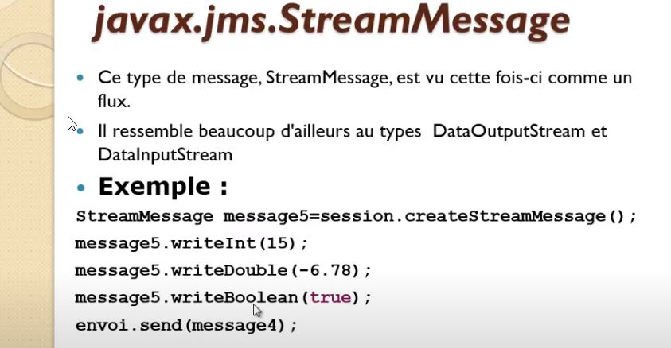

# JMS ( java messsage service)

## Introduction


### Messages Synchrones


### Messages asynchrones


MOM message oriented midlleware


Il faut préviligier la sauvegarde des messages coté application et non coté **provider** de messages.

## JMS

ActiveMQ supporte tous les protocoles de message , tcp, ampq, stomp, mqtt


### Protocole


#### protocle Queue


#### protocle Topic


#### consommation de messages


### model Programmation JMS

Pour etablir une communication avec un broker


### Diagramme de séquence
Dans la programme client JMS , les api utilisé sont les APIs du brocker.

L'objet **ConnectionFactory** est une **interface** de specifiation de **JSM** de communcation . Chaque borker ( ActiveMQ, rabbitMQ ....) doivent implémenter cette interface.

```java
ConnectionFactory connectionFactoryInterface = new ActiveMQConnectionFactory("tcp://localhost:61616");
```

#### producer
Le **producer** peut envoyer une infinitée de message dans la **Queue**, meme si consumer n'est pas disponible


le parametre boolean false indique que par défaut le commit est implicite des que le message est envoyé nous n'avons pas besoin de faire un commit apres l'envoi du message. Message dit Transactionnel. Sinon si c'est true il faut expliciement faire un commit apres l'envoi du message.(Message dit non transactionnel)
```java
Session session = connection.createSession(false, Session.AUTO_ACKNOWLEDGLE)
```
#### consumer
L'objet **Consumer** doit souscrire à un abonnement de type **synchrone** via **receive** ou de type **asynchrone** via **listen**


##### synchrone
Il n'est pas recommander de faire de la synchrone car il faut implémenter une boucle pour aller voir si l'on a recu un messge ou non.


##### asynchrone


### Java code

#### Producer


 entete message


corp de message


- Byte message


- Text Message


- Object Message


- Map Message


- Stream Message



#### Consumer


### Lancer activeMQ

```bash
D:\activeMQ\apache-activemq-5.15.12-bin\apache-activemq-5.15.12\bin
λ activemq.bat start
Java Runtime: Oracle Corporation 1.8.0_162 C:\Program Files\Java\jdk1.8.0_162\jre
  Heap sizes: current=1005056k  free=989327k  max=1005056k
    JVM args: -Dcom.sun.management.jmxremote -Xms1G -Xmx1G -Djava.util.logging.config.file=logging.properties -Djava.security.auth.login.config=D:\activeMQ\apache-activemq-5.15.12-bin\apache-activemq-5.15.12\bin\..\conf\login.config -Dactivemq.classpath=D:\activeMQ\apache-activemq-5.15.12-bin\apache-activemq-5.15.12\bin\..\conf;D:\activeMQ\apache-activemq-5.15.12-bin\apache-activemq-5.15.12\bin\../conf;D:\activeMQ\apache-activemq-5.15.12-bin\apache-activemq-5.15.12\bin\../conf; -Dactivemq.home=D:\activeMQ\apache-activemq-5.15.12-bin\apache-activemq-5.15.12\bin\.. -Dactivemq.base=D:\activeMQ\apache-activemq-5.15.12-bin\apache-activemq-5.15.12\bin\.. -Dactivemq.conf=D:\activeMQ\apache-activemq-5.15.12-bin\apache-activemq-5.15.12\bin\..\conf -Dactivemq.data=D:\activeMQ\apache-activemq-5.15.12-bin\apache-activemq-5.15.12\bin\..\data -Djava.io.tmpdir=D:\activeMQ\apache-activemq-5.15.12-bin\apache-activemq-5.15.12\bin\..\data\tmp
Extensions classpath:
  [D:\activeMQ\apache-activemq-5.15.12-bin\apache-activemq-5.15.12\bin\..\lib,D:\activeMQ\apache-activemq-5.15.12-bin\apache-activemq-5.15.12\bin\..\lib\camel,D:\activeMQ\apache-activemq-5.15.12-bin\apache-activemq-5.15.12\bin\..\lib\optional,D:\activeMQ\apache-activemq-5.15.12-bin\apache-activemq-5.15.12\bin\..\lib\web,D:\activeMQ\apache-activemq-5.15.12-bin\apache-activemq-5.15.12\bin\..\lib\extra]
ACTIVEMQ_HOME: D:\activeMQ\apache-activemq-5.15.12-bin\apache-activemq-5.15.12\bin\..
ACTIVEMQ_BASE: D:\activeMQ\apache-activemq-5.15.12-bin\apache-activemq-5.15.12\bin\..
ACTIVEMQ_CONF: D:\activeMQ\apache-activemq-5.15.12-bin\apache-activemq-5.15.12\bin\..\conf
ACTIVEMQ_DATA: D:\activeMQ\apache-activemq-5.15.12-bin\apache-activemq-5.15.12\bin\..\data
Loading message broker from: xbean:activemq.xml
 INFO | Refreshing org.apache.activemq.xbean.XBeanBrokerFactory$1@eec5a4a: startup date [Sun Apr 12 14:50:20 CEST 2020]; root of context hierarchy
 INFO | Using Persistence Adapter: KahaDBPersistenceAdapter[D:\activeMQ\apache-activemq-5.15.12-bin\apache-activemq-5.15.12\bin\..\data\kahadb]
 INFO | PListStore:[D:\activeMQ\apache-activemq-5.15.12-bin\apache-activemq-5.15.12\bin\..\data\localhost\tmp_storage] started
 INFO | Apache ActiveMQ 5.15.12 (localhost, ID:DESKTOP-C5FOTFM-65436-1586695824694-0:1) is starting
 INFO | Listening for connections at: tcp://DESKTOP-C5FOTFM:61616?maximumConnections=1000&wireFormat.maxFrameSize=104857600
 INFO | Connector openwire started
 INFO | Listening for connections at: amqp://DESKTOP-C5FOTFM:5672?maximumConnections=1000&wireFormat.maxFrameSize=104857600
 INFO | Connector amqp started
 INFO | Listening for connections at: stomp://DESKTOP-C5FOTFM:61613?maximumConnections=1000&wireFormat.maxFrameSize=104857600
 INFO | Connector stomp started
 INFO | Listening for connections at: mqtt://DESKTOP-C5FOTFM:1883?maximumConnections=1000&wireFormat.maxFrameSize=104857600
 INFO | Connector mqtt started
 INFO | Starting Jetty server
 INFO | Creating Jetty connector
 WARN | ServletContext@o.e.j.s.ServletContextHandler@48e92c5c{/,null,STARTING} has uncovered http methods for path: /
 INFO | Listening for connections at ws://DESKTOP-C5FOTFM:61614?maximumConnections=1000&wireFormat.maxFrameSize=104857600
 INFO | Connector ws started
 INFO | Apache ActiveMQ 5.15.12 (localhost, ID:DESKTOP-C5FOTFM-65436-1586695824694-0:1) started
 INFO | For help or more information please see: http://activemq.apache.org
 INFO | ActiveMQ WebConsole available at http://0.0.0.0:8161/
 INFO | ActiveMQ Jolokia REST API available at http://0.0.0.0:8161/api/jolokia/
```


web console  ( admin / admin)
http://localhost:8161/admin/queueGraph.jsp

###  ActiveMQ embedded in application


### transport connection


### JNDI


### KahaDB


### Stream


### Mise en oeuvre 

[Server jms activeMQ embedded](doc/ServerJavaEmbeded.md)
[jms activeMQ Cliçent JSM](doc/miseEnOeuvreJmsClient.md)
[activeMQ ](doc/ActiveMQ.md)
